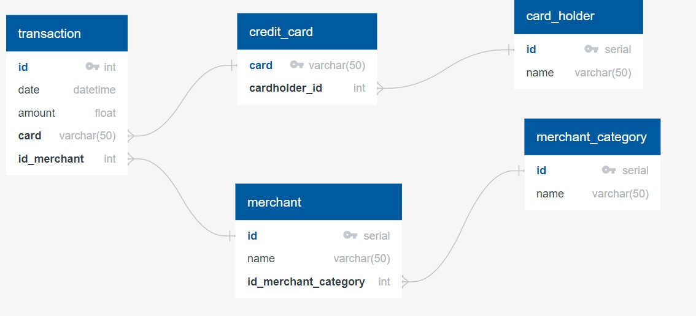
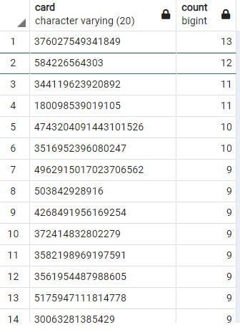
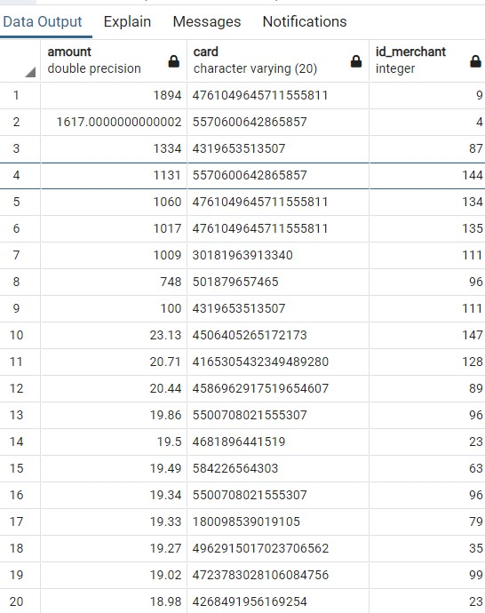
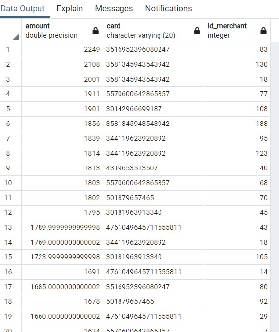
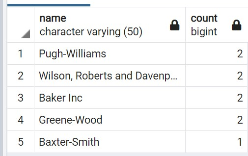

# Answers to HW7 Sequel

## ERD File

## Part 1
### Small transactoins
There seem to a few cards that have 9-13 transactions of less than dollar 2. We would need to see if they are all at the same day or a different day to know if it is hacked. 

Figure 1: Transactions < Dollar 2

### Top 100 Transactions. 
Both the time frames (7am to 9am) and (< 7am and > 9am) have large transactions. However the transactions with many decimal places seem odd. Comparing 2 hrs with 22 hrs visually seems to be not very rigorous. So I cannot really make a call

Figure 2 Transactions between 7 and 9

Figure 3 Transactions before 7am or after 9am

The following are the top merchants being hacked with small charges

Figure 4: Top Merchants Fraud for < 2 dollars